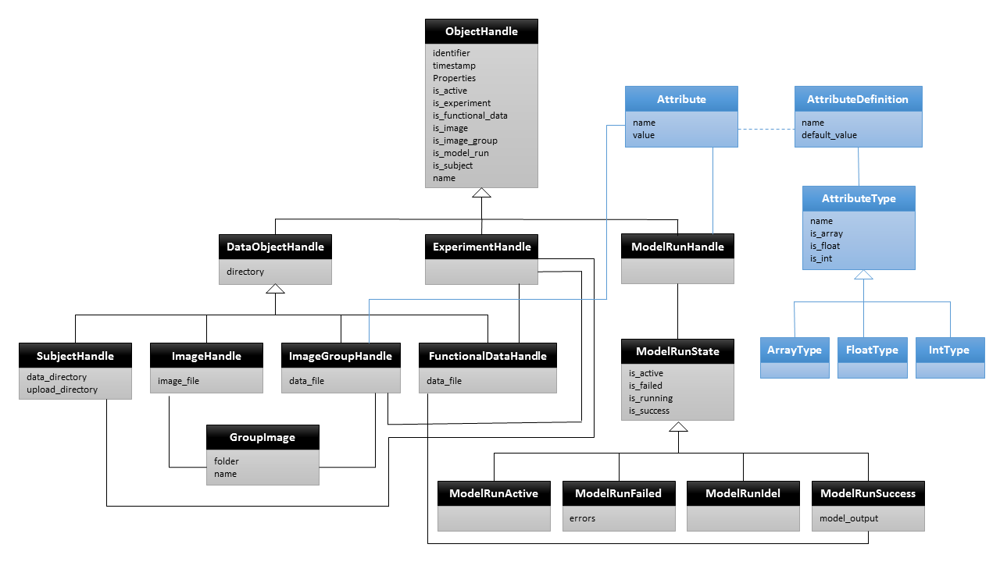

# Standard Cortical Observer - Data Store

The Standard Cortical Observer Data Store (SCO-DS) manages and provides access to files and data objects that are input to predictive model runs, as well as outputs from these model runs.


## Architecture

The overall architecture and details about the default implementation of the SCO-DS are shown in Figure 1. The SCO-DS manages information about object properties in a database. The default implementation uses MongoDB. In addition, several database objects are associated with external files, e.g., subjects are primarily defined by a Freesurfer directory, images and image groups, functional data, etc.. These files are currently stored on the file system.


## Data Model

The data store is implemented as a Python library. The library provides an API to access and manipulate objects in the SCO-DS database and on the file system. The data model of the data store library is shown in Figure 2.  The following is a discussion of the basic objects and API calls in this model.



Figure 2: Entities in the SCO-DS data model.


### ObjectHandle

Every object in the SCO-DS is a sub-class of the basic database object handle. Each object has a unique identifier, a timestamp of creation, a list of properties represented as key,value-pairs, and a descriptive name.

The object handle contains properties to determine the type of sub-classes through is_type properties that are added for each sub-class. Having these properties is helpful to decouple the implementation of the data store from the Web API.


### DataObjectHandle

Data objects are objects that have additional data associated with them. In the current implementation this data is expected to be stored as file. Thus, data objects extend database object with a reference to a local directory.


### ExperimentHandle

Handle to access and manipulate an experiment configuration. Each experiment encapsulates a  subject, an image group, and an optional functional data object.


### ImageHandle

Handle to access and manipulate an image file. The image file is stored on disk. File name and Mime type of the image are part of the mandatory, immutable set of object properties.


### ImageGroupHandle

Handle to access and manipulate a collection of image files. The directory contains a zipped tar-file containing images in the group. Extends the data object handle with a list of object identifier for image objects in the group.

Each image group is associated with a set of options (i.e., typed attributes). The list possible and required options can be modified (currently by modifying the Python code only). The current list of options includes:

- stimulus_pixels_per_degree (required): Number of pixels per degree in the stimulus images. Must be > 0.
- stimulus_edge_value (default = 0.5): The background gray level value for the stimulus display. Must be >= 0 and <= 1.
- stimulus_aperture_edge_width: The width of smoothed aperture in pixels. Must be >= 0.
- normalized_stimulus_aperture: The radius of the stimulus aperture in pixels. Must be >= 0.
- stimulus_gamma: The gamma function. **Must be a list or matrix of n numbers or pairs of numbers.**


### FunctionalDataHandle

Handle to access and manipulate brain responses data object. Functional data are either generated by upload of fMRI data archives or from predictive model runs.


### ModelRunHandle

Handle to access and manipulate an object representing a model run and its state information. The status of the model run is maintained as a separate object. A run that has completed successfully will have a prediction result associated with its state. In case of failure, there will be an a list of error messages associated with its state.

Model runs are associated with a set of arguments. The current list of possible arguments is:

- gabor_orientations (default = 8): The number of gabor filter orientations to use in this model. Must be an integer > 0.
- max_eccentricity (default = 12): The maximum eccentricity to which to predict results. Must be > 0 and < 90.
- normalized_pixels_per_degree: The number of pixels per degree after image normalization. Most be > 0.


### SubjectHandle

Handle for subject brain anatomy objects. Subjects are created by upload of data files (currently Freesurfer directories). The subject handle class defines two additional directories on the local disk. One directory contains the originally uploaded tar archive and the other directory the unpacked data files (for faster local access).


## API

The following lists the signatures of available API methods to access and manipulate objects in the SCO-DS

### Experiments

```
experiments_create(name, subject, images)
experiments_delete(identifier)
experiments_upsert_property(identifier, key, value=None)
experiments_get(identifier)
experiments_list(limit=-1, offset=-1)
experiments_fmri_create(identifier, filename)
experiments_fmri_delete(identifier)
experiments_fmri_download(identifier)
experiments_fmri_get(identifier)
experiments_fmri_upsert_property(self, identifier, key, value=None)
experiments_predictions_create(experiment, name, arguments=None)
experiments_predictions_delete(experiment, prediction)
experiments_predictions_download(experiment, prediction)
experiments_predictions_get(experiment, prediction)
experiments_predictions_list(experiment, limit=-1, offset=-1)
experiments_predictions_update_state(experiment, prediction, state)
experiments_predictions_upsert_property(experiment, prediction, key, value=None)
```

### Images

```
images_create(filename)
image_files_delete(identifier)
image_files_download(identifier)
image_files_get(identifier)
image_files_list(limit=-1, offset=-1)
image_files_upsert_property(identifier, key, value=None)
image_groups_delete(identifier)
image_groups_download(identifier)
image_groups_get(identifier)
image_groups_list(limit=-1, offset=-1)
image_groups_update_options(identifier, options)
image_groups_upsert_property(identifier, key, value=None)
```

### Subjects

```
subjects_create(filename)
subjects_delete(identifier)
subjects_download(identifier)
subjects_get(identifier)
subjects_list(limit=-1, offset=-1)
subjects_upsert_property(identifier, key, value=None)
```
